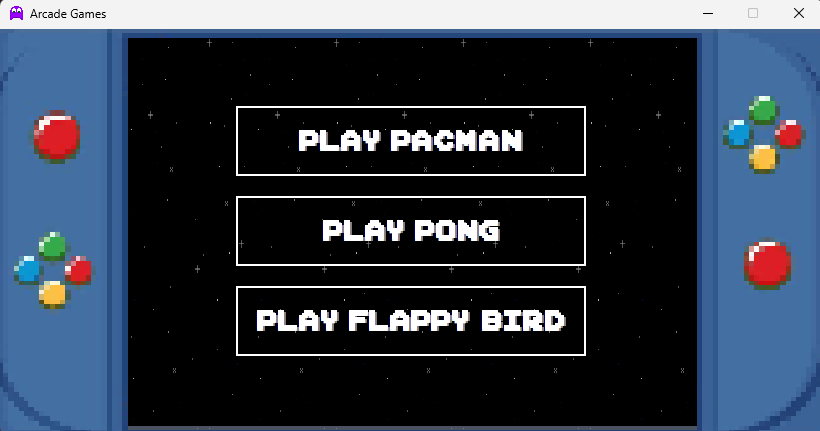
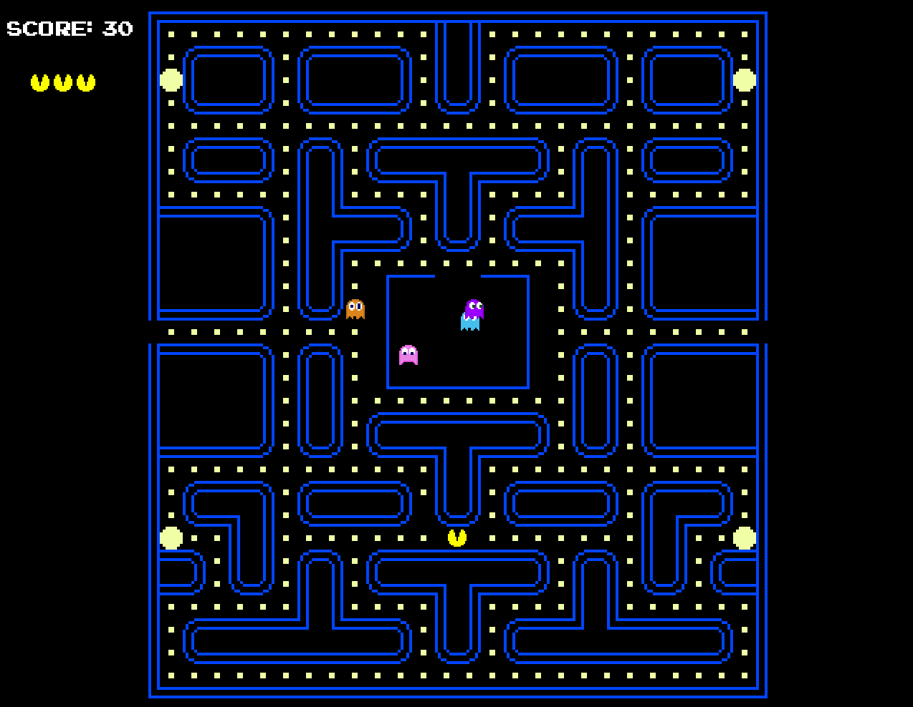
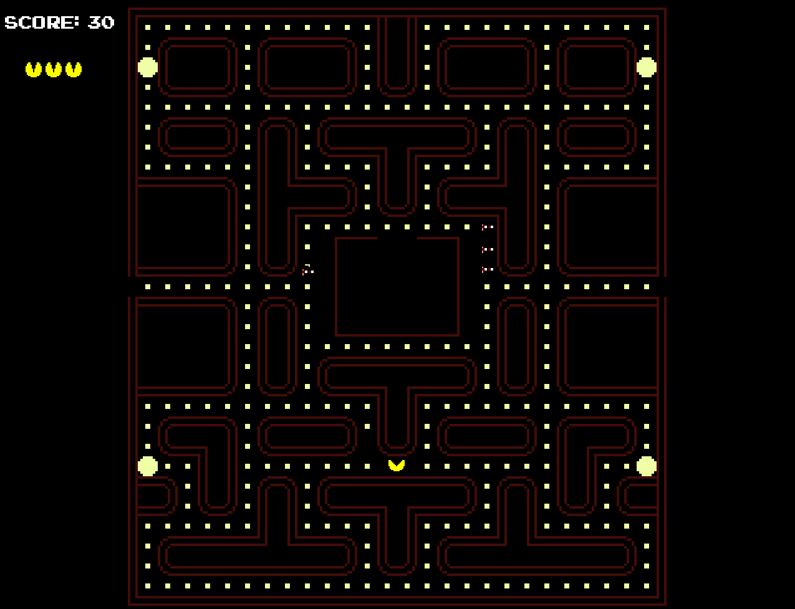
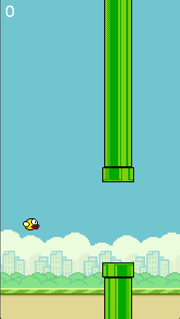
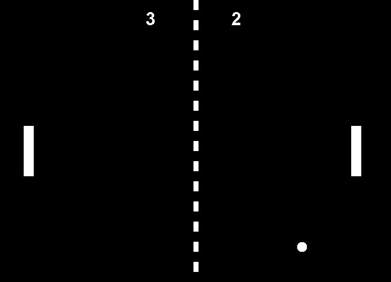

# Arcade Games

This is a small arcade-style project that was made in a week for a class project with two team members. 

It features a **main menu** where the player can choose between three classic-style games: **Pac-Man**, **Flappy Bird**, and **Pong**.

The project was made in Java, using Java swing, although the project code is a bit rough in places.
This was my first time ever making a game (although simple) and the first time actually dealing with the consequences of not corectly using version control, but I learned a lot and had a ton of fun building it.

## How It Works

The **main menu** lets you pick which game to play. Each game runs independently:

- **Pac-Man** – Single-player classic Pacman game... or try hard mode.
- **Flappy Bird** – Also a single-player classic flappy bird game.
- **Pong** – Multiplayer. Two users can play against each other using WASD and the arrow keys.

# Screenshots

## **Pac-Man**  

## **Pac-Man HARDMODE**  

## **Flappy Bird**  

## **Pong**  

## Bugs / Known Issues

- **Pong window placement**: When opened, the Pong screen does not place correctly. Other games open in the center where the menu was.
- **Menu navigation**: Cannot return to the main menu from Pac-Man.
- **Ghost Releasing**: Ghosts occasionally don't release from starting base, only in normal mode.

---